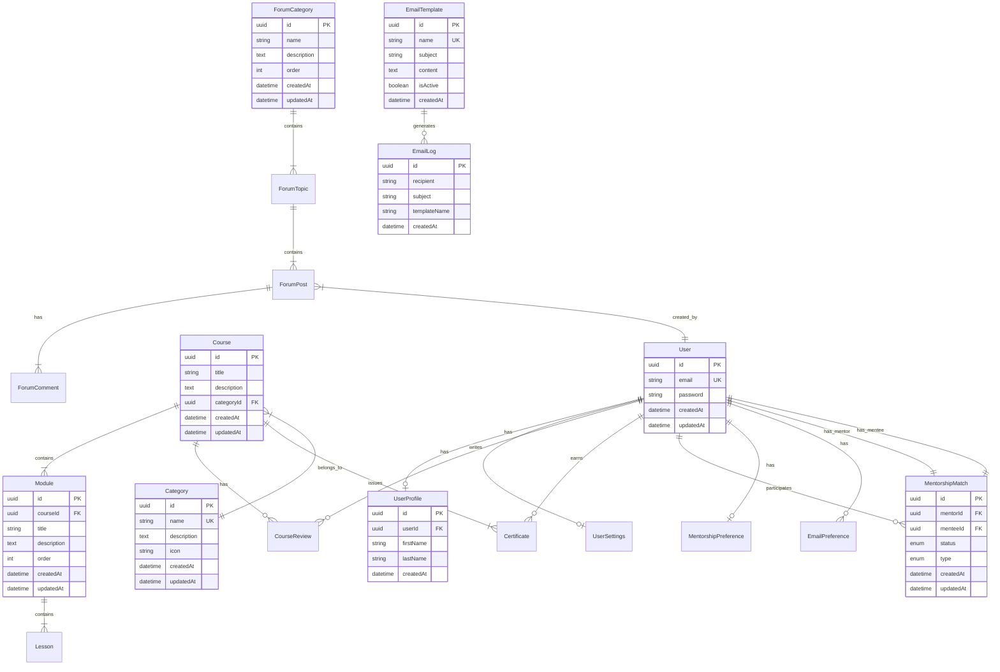

# Database Entity Relationship Diagram

## Overview
This document provides a visual representation of the database schema using Mermaid diagrams.

## Core Entities

## Legend
- PK: Primary Key
- FK: Foreign Key
- UK: Unique Key

## Relationship Types
- `||--||` : One to One
- `||--|{` : One to Many
- `}|--|{` : Many to Many
- `||--o|` : One to Zero or One
- `||--o{` : One to Zero or Many

## Notes
1. All entities use UUID as primary keys
2. Most entities include timestamps (createdAt, updatedAt)
3. Foreign key relationships are enforced at the database level
4. Enum types are used for status and type fields
5. Indexes are created on frequently queried fields (not shown in diagram)